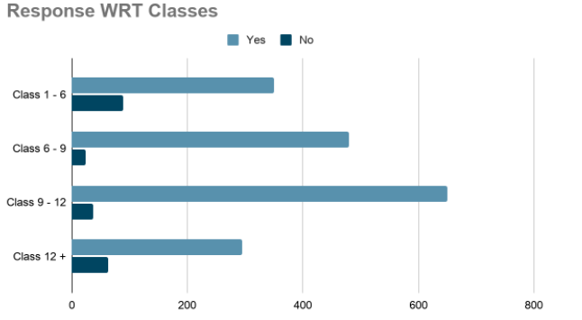
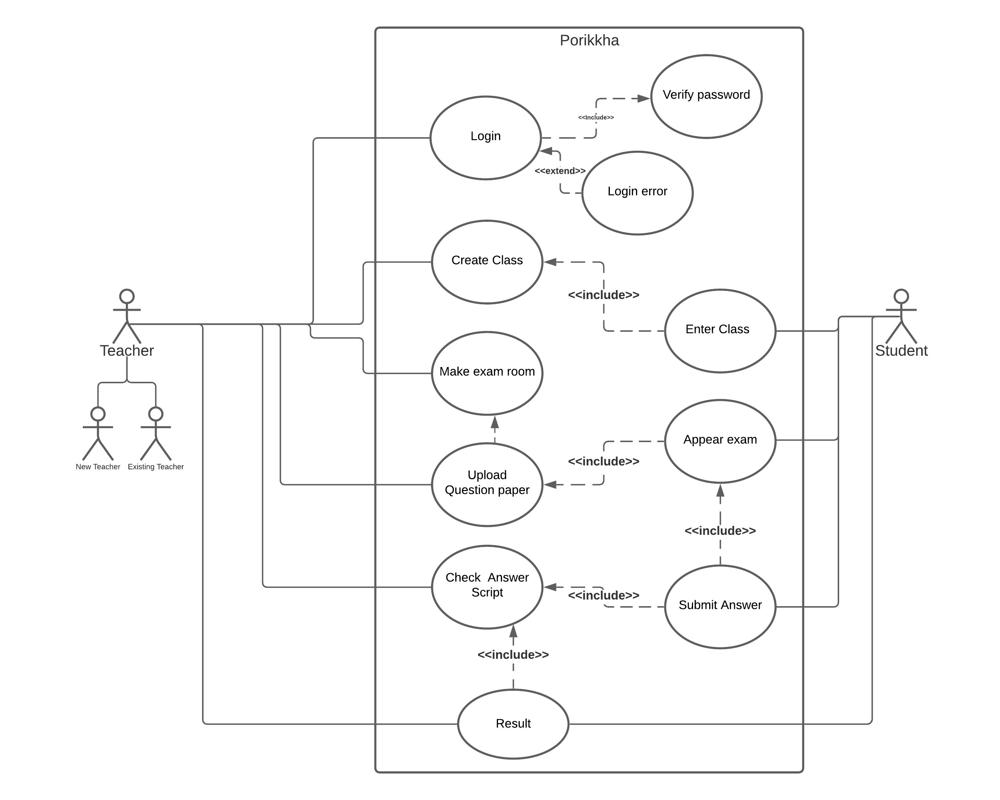
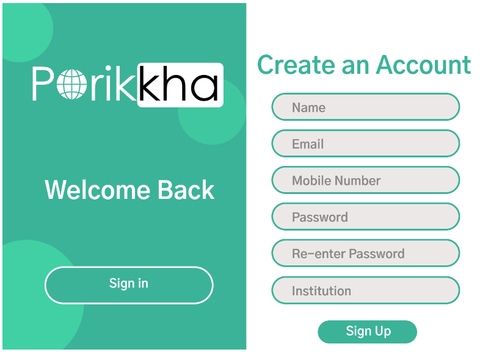
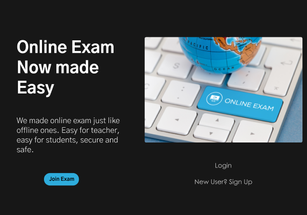
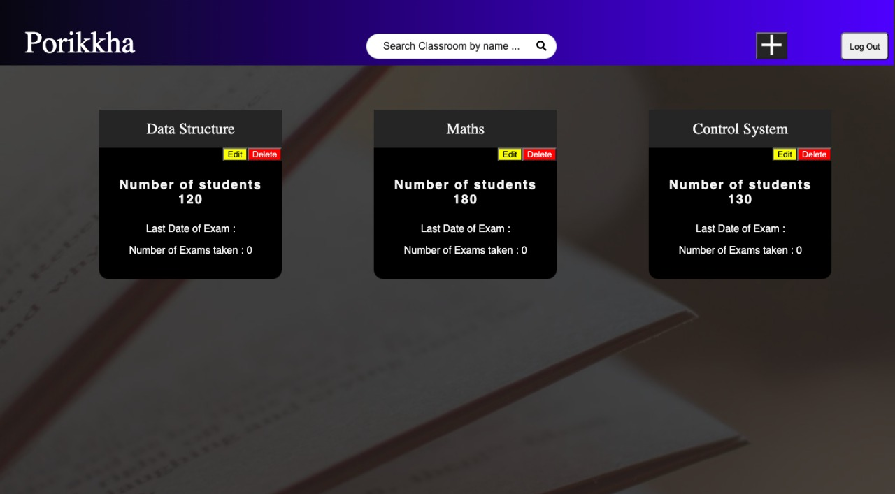
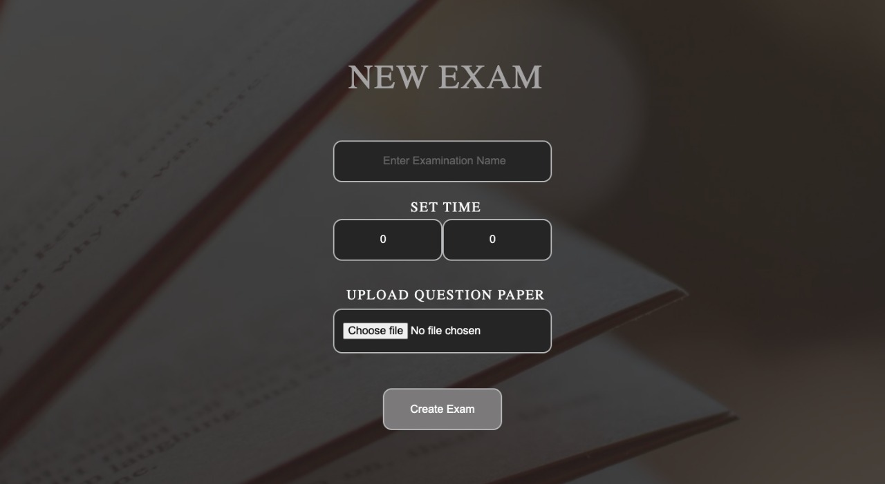
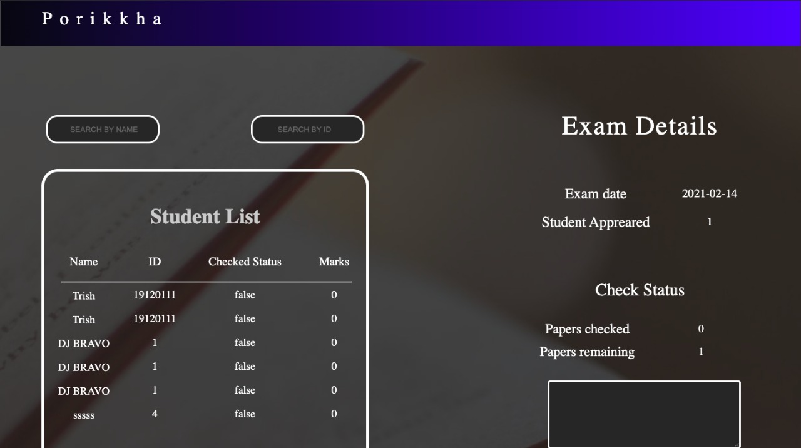

## UNNAMED CREATORS <*Porikkha*>

### Problem Overview

* PORIKKHA With the dawn of the era of digitalization, there has been a surge in the number of online courses, such as MBA, BA, BSc, etc., to promote better quality education and facilitate the process of learning

* With the onset of the pandemic, it has become extremely crucial for all kinds of educational institutions to adopt the online mode of imparting education.

*Main Idea Here {is simply dummy text of the printing and typesetting industry.}

### Market Research
* Over 36 lakh learners are pursuing online degree courses and around 1 lakh students are pursuing DLP Programs from E-Learning platforms for exams that require writing (UPSC, Boards etc.)

* Even with the pandemic almost over, still, over 2 lakh students shall appear online exams in the next six months, which gives us a huge kick-start
#### Response from teachers about an online paper checking platform

#### Technical Stack

* Mongo DB
* Express
* React
* Node.js
* Heroku for test deployment
* Google Cloud for Future 

### USE CASE

## Solution
###An Exam Portal
* Would Replicate  an offline like environment
* Evaluation of answer scripts would be similar to offline behavior curbing down the issues of online paper checking. 
* UI would render offline exam experience to both teachers and students.
* Teachers would be able to mark on the submitted answer scripts with the marks given on each page being automatically added, thus eliminating the process of totaling and corresponding errors.
* Dark Mode would enable in making the evaluation process comfortable by reducing the stress on eyes that might result otherwise.
* UX would provide a real-time exam experience

## Screenshots
* Sign Up page

* Landing page

* Create Room

* Create Exam

* student List

## FUTURE PROSPECT
* ML Based marking system
* ML Based anti cheat measures
* Direct typing of question paper in portal

### Team Members

|Member Name|Scholar ID|
|-----------|-----|
|Dhritiraj Bohar|1914011|
|Trishanku Sharma|1912170|
|Nihar Jyoti Basisth|1912099|

